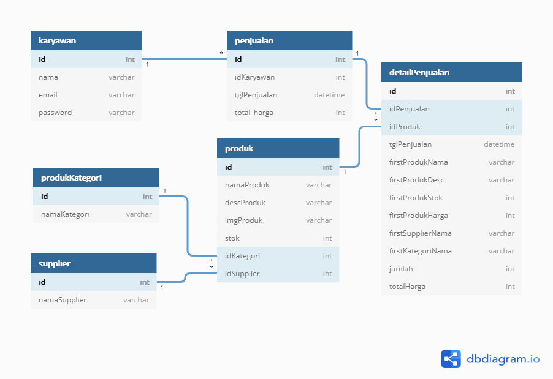

# Task-BE implement heroku

### ERD

[Link Diagram](https://dbdiagram.io/d/600a20fc80d742080a376392)

### Mockoon API

Daftar Endpoint :

- /karyawan , method yang digunakan GET, POST
- /karyawan/:id , method yang digunakan PUT, DELETE

- /supplier , method yang digunakan GET, POST
- /supplier/:id , method yang digunakan PUT, DELETE

- /produkKategori , method yang digunakan GET, POST
- /produkKategori/:id , method yang digunakan PUT, DELETE

- /produk , method yang digunakan GET, POST
- /produk/:id , method yang digunakan PUT, DELETE

- /penjualan , method yang digunakan POST
- /penjualan/:id, method yang digunakan GET

### Link Postman

[Link Postman](https://documenter.getpostman.com/view/6043463/TW6uoUaa#66240922-e5dd-4729-a7b4-06b63b57fa03)

### Link Deploy Heroku 

[Link Api heroku](https://tranquil-citadel-90903.herokuapp.com/)